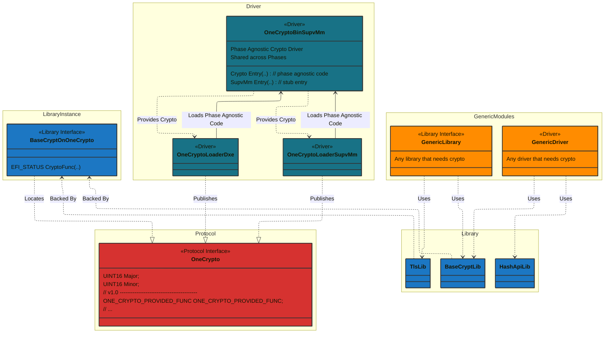

# BaseCryptLibOnOneCrypto

## Overview

BaseCryptLibOnOneCrypto provides the BaseCryptLib and TlsLib APIs by calling the OneCrypto protocol published by a
single EFI binary. That design delivers:

- 🛠️ **Simplified maintenance** – a single, versioned payload keeps every cryptographic primitive together, so platforms
  update one binary instead of juggling per-function libraries.
- 🔁 **Crypto agility** – new cipher suites or algorithm replacements are enabled by swapping the OneCrypto binary,
  leaving platform consumers untouched.

**Platform code must never call the OneCrypto protocol directly.** Always use this library to ensure version safety,
type safety, and robust error handling.

### Why Not Call the Protocol Directly?

Direct protocol usage is unsafe: protocol structure and function signatures may change, breaking binary compatibility
and introducing security risks. This library provides:

- **Version validation** (at runtime, using protocol major/minor)
- **Type safety** (strong C API)
- **Consistent error handling**
- **Stable API** (insulates platform code from protocol changes)
- **Automatic initialization and protocol lookup**

## Usage

BaseCryptLib and TlsLib are provided through phase-specific library instances. See the detailed configuration
examples below in the [How to Use BaseCryptLibOnOneCrypto](#how-to-use-basecryptlibononecrypto) section.

## Architecture



**Architecture Components:**

- **Platform Code**: Uses standard BaseCryptLib/TlsLib/HashApiLib APIs
- **OneCrypto Loaders**: Contain enough logic to find and load the phase agnostic code
- **OneCrypto Binary Driver**: Contains Phase agnostic cryptographic implementations
- **BaseCryptLibOnOneCrypto Library**: Provides version checking, type safety, error handling, and API translation

## How to Use BaseCryptLibOnOneCrypto

### In Your Platform DSC File

#### Configure Library Classes for Each Phase

BaseCryptLib and TlsLib must be configured for each execution phase that needs cryptographic services:

**For DXE Drivers and Applications:**

```inf
[LibraryClasses.common.UEFI_DRIVER, LibraryClasses.common.DXE_DRIVER, LibraryClasses.common.UEFI_APPLICATION]
  BaseCryptLib|CryptoPkg/Library/BaseCryptLibOnOneCrypto/DxeCryptLib.inf
  TlsLib|CryptoPkg/Library/BaseCryptLibOnOneCrypto/DxeCryptLib.inf
```

**For Standalone MM:**

```inf
[LibraryClasses.common.MM_CORE_STANDALONE, LibraryClasses.common.MM_STANDALONE]
  BaseCryptLib|CryptoPkg/Library/BaseCryptLibOnOneCrypto/StandaloneMmCryptLib.inf
  TlsLib|CryptoPkg/Library/BaseCryptLibOnOneCrypto/StandaloneMmCryptLib.inf
```

#### Add OneCrypto Binary Drivers

These will provide a safe call into the OneCrypto binary.

The OneCrypto binary drivers are provided as an external dependency. The build system automatically sets the
`ONE_CRYPTO_PATH` variable to point to the extracted binaries.

Add the OneCrypto components to your platform DSC:

```dsc
[Components]
  # OneCrypto binary drivers
  # ONE_CRYPTO_PATH is set by the build system from the external dependency
  $(ONE_CRYPTO_PATH)/OneCryptoLoaders/OneCryptoLoaderDxe.inf
  $(ONE_CRYPTO_PATH)/OneCryptoLoaders/OneCryptoLoaderSupvMm.inf  # For MM Supervisor mode
  $(ONE_CRYPTO_PATH)/OneCryptoBin/OneCryptoBinSupvMm.inf

  # Or for traditional Standalone MM:
  # $(ONE_CRYPTO_PATH)/OneCryptoLoaders/OneCryptoLoaderStandaloneMm.inf
  # $(ONE_CRYPTO_PATH)/OneCryptoBin/OneCryptoBinStandaloneMm.inf
```

And include them in your FDF:

```fdf
INF $(ONE_CRYPTO_PATH)/OneCryptoLoaders/OneCryptoLoaderDxe.inf
INF $(ONE_CRYPTO_PATH)/OneCryptoLoaders/OneCryptoLoaderSupvMm.inf
INF $(ONE_CRYPTO_PATH)/OneCryptoBin/OneCryptoBinSupvMm.inf
```

### In Your C Code

Simply include and use the standard BaseCryptLib API:

```c
#include <Library/BaseCryptLib.h>

EFI_STATUS
MyFunction (
  VOID
  )
{
  UINT8   Hash[32];
  UINTN   HashSize;
  VOID    *Sha256Context;

  // Initialize SHA256 context
  Sha256Context = Sha256New();
  if (Sha256Context == NULL) {
    return EFI_OUT_OF_RESOURCES;
  }

  // Use standard BaseCryptLib functions
  if (!Sha256Init(Sha256Context)) {
    Sha256Free(Sha256Context);
    return EFI_DEVICE_ERROR;
  }

  // The library handles all protocol interactions internally
  Sha256Update(Sha256Context, Data, DataSize);
  Sha256Final(Sha256Context, Hash);
  Sha256Free(Sha256Context);

  return EFI_SUCCESS;
}
```

## Adding New Cryptographic Functions (Detailed Guide)

This section provides a comprehensive guide for adding new cryptographic functions to the OneCrypto platform.
Follow these steps in order to ensure proper integration, version compatibility, and testing.

### Step 1: Add the Function to BaseCryptLib.h (Public API)

Add your new function declaration to the public API header file. This is the interface that all platform code will use.

**Location:** `CryptoPkg/Include/Library/BaseCryptLib.h`

**Example:** Adding a new generic cryptographic function:

```c
/**
  Allocates and initializes one CRYPTO context for subsequent operations.

  @return  Pointer to the CRYPTO context that has been initialized.
           If the allocations fails, GenericCryptoNew() returns NULL.
**/
VOID *
EFIAPI
GenericCryptoNew (
  VOID
  );

/**
  Performs a cryptographic operation on a data buffer of the specified size.

  This function performs the cryptographic operation on the given data buffer,
  and places the resulting output into the output buffer.

  If Context is NULL, then return FALSE.
  If InputData is NULL and InputSize is not zero, then return FALSE.
  If OutputData is NULL, then return FALSE.

  @param[in]   Context      Pointer to the CRYPTO context.
  @param[in]   InputData    Pointer to the buffer containing the data to be processed.
  @param[in]   InputSize    Size of InputData buffer in bytes.
  @param[out]  OutputData   Pointer to a buffer that receives the output.
  @param[out]  OutputSize   Pointer to the size of the output buffer.

  @retval TRUE   Cryptographic operation succeeded.
  @retval FALSE  Cryptographic operation failed.
**/
BOOLEAN
EFIAPI
GenericCryptoProcess (
  IN   VOID         *Context,
  IN   CONST VOID   *InputData,
  IN   UINTN        InputSize,
  OUT  UINT8        *OutputData,
  OUT  UINTN        *OutputSize
  );
```

---

### Step 2: Add NULL Stubs to BaseCryptLibNull

Add stub implementations that return failure. This allows the CI build to succeed even when modules don't need crypto functionality.

**Location:** `CryptoPkg/Library/BaseCryptLibNull/*.c` (or appropriate file based on function category)

**About File Organization:**

The BaseCryptLib implementation is organized into logical groups that correspond to source files:

- `Hash.c` - Hashing functions (SHA256, SHA384, SHA512, etc.)
- `Hmac.c` - HMAC functions
- `Cipher.c` - Symmetric encryption (AES, etc.)
- `Pk.c` - Public key cryptography (RSA, ECC)
- `Rand.c` - Random number generation
- `Tls.c` - TLS/SSL functions
- `Bn.c` - Big number operations

Choose the appropriate file for your function based on its cryptographic category. This helps developers find related
implementations and keeps the codebase organized.

**Example:**

```c
/**
  Allocates and initializes one CRYPTO context for subsequent operations.

  @return  NULL  This interface is not supported.
**/
VOID *
EFIAPI
GenericCryptoNew (
  VOID
  )
{
  ASSERT (FALSE);
  return NULL;
}

/**
  Performs a cryptographic operation on a data buffer of the specified size.

  @param[in]   Context      Pointer to the CRYPTO context.
  @param[in]   InputData    Pointer to the buffer containing the data to be processed.
  @param[in]   InputSize    Size of InputData buffer in bytes.
  @param[out]  OutputData   Pointer to a buffer that receives the output.
  @param[out]  OutputSize   Pointer to the size of the output buffer.

  @retval FALSE  This interface is not supported.
**/
BOOLEAN
EFIAPI
GenericCryptoProcess (
  IN   VOID         *Context,
  IN   CONST VOID   *InputData,
  IN   UINTN        InputSize,
  OUT  UINT8        *OutputData,
  OUT  UINTN        *OutputSize
  )
{
  ASSERT (FALSE);
  return FALSE;
}
```

**Why This Matters:**

- Allows modules to compile without linking real crypto implementations
- Enables CI builds that don't require binary dependencies
- The `ASSERT(FALSE)` catches accidental usage in debug builds

---

### Step 3: Add Function Pointer to OneCrypto.h Protocol Structure

Add the new function pointer to the **end** of the `ONE_CRYPTO_PROTOCOL` structure and increment the **Minor** version number.

You may add several functions at the same time.

**Location:** `CryptoPkg/Include/Protocol/OneCrypto.h`

**Example:**

```c
// Before:
#define VERSION_MAJOR  1
#define VERSION_MINOR  0  // Previous version

typedef struct _ONE_CRYPTO_PROTOCOL {
  UINT32                            Major;
  UINT32                            Minor;

  // ... existing function pointers ...

  ONE_CRYPTO_SHA256_FINAL           Sha256Final;
  ONE_CRYPTO_SHA256_HASH_ALL        Sha256HashAll;

  // Add new functions here at the end
} ONE_CRYPTO_PROTOCOL;

// After:
#define VERSION_MAJOR  1
#define VERSION_MINOR  1  // Incremented!

typedef struct _ONE_CRYPTO_PROTOCOL {
  UINT32                            Major;
  UINT32                            Minor;

  // ... existing function pointers ...

  ONE_CRYPTO_SHA256_FINAL           Sha256Final;
  ONE_CRYPTO_SHA256_HASH_ALL        Sha256HashAll;

  /// v1.1 GENERIC --------------------------------------------------------------
  ONE_CRYPTO_GENERIC_NEW            GenericCryptoNew;
  ONE_CRYPTO_GENERIC_PROCESS        GenericCryptoProcess;
} ONE_CRYPTO_PROTOCOL;
```

Also define the function pointer types with appropriate Doxygen documentation:

```c
/**
  Allocates and initializes one CRYPTO context for subsequent operations.

  @return  Pointer to the CRYPTO context that has been initialized.

  @since 1.1
  @ingroup YourGroupName
**/
typedef
VOID *
(EFIAPI *ONE_CRYPTO_GENERIC_NEW)(
  VOID
  );

/**
  Performs a cryptographic operation on a data buffer of the specified size.

  @param[in]   Context      Pointer to the CRYPTO context.
  @param[in]   InputData    Pointer to the buffer containing the data to be processed.
  @param[in]   InputSize    Size of InputData buffer in bytes.
  @param[out]  OutputData   Pointer to a buffer that receives the output.
  @param[out]  OutputSize   Pointer to the size of the output buffer.

  @retval TRUE   Cryptographic operation succeeded.
  @retval FALSE  Cryptographic operation failed.

  @since 1.1
  @ingroup YourGroupName
**/
typedef
BOOLEAN
(EFIAPI *ONE_CRYPTO_GENERIC_PROCESS)(
  IN   VOID         *Context,
  IN   CONST VOID   *InputData,
  IN   UINTN        InputSize,
  OUT  UINT8        *OutputData,
  OUT  UINTN        *OutputSize
  );
```

**About Doxygen `@ingroup`:**

The `@ingroup` tag is used for Doxygen documentation generation and is **not required** for compilation. It organizes
functions into logical groups in the generated HTML documentation. Available groups in `OneCrypto.h` include:

- `Hash` - Hashing functions (SHA, MD5, SM3)
- `HMAC` - HMAC functions
- `AES` - AES encryption/decryption
- `BN` - Big number operations
- `HKDF` - Key derivation functions
- `PKCS` - Public key cryptography standards
- `DH` - Diffie-Hellman key exchange
- `EC` - Elliptic curve cryptography
- `RSA` - RSA public key operations
- `X509` - Certificate handling
- `Random` - Random number generation
- `Tls` - TLS/SSL operations
- `Timestamp` - RFC3161 timestamp verification
- `Info` - Library information

Choose the most appropriate group for your function. If adding an entirely new category of cryptographic functions, you
may need to define a new `@defgroup` at the top of the section where you add your functions.

**Critical Rules:**

- **Always add to the end** of the structure (maintains binary compatibility)
- **Increment Minor version** for new functions (Major version changes are breaking changes)
- **Never reorder or remove existing function pointers**
- Document which version introduced each function

---

### Step 4: Update BaseCryptLibOnOneCrypto to Call the Protocol

Implement the BaseCryptLib function by calling the protocol using the `CALL_CRYPTO_SERVICE` macro.

**Location:** `CryptoPkg/Library/BaseCryptLibOnOneCrypto/CryptoService.c` (or appropriate file)

**Example:**

```c
/**
  Allocates and initializes one CRYPTO context for subsequent operations.

  @return  Pointer to the CRYPTO context that has been initialized.
           If the allocations fails, GenericCryptoNew() returns NULL.
**/
VOID *
EFIAPI
GenericCryptoNew (
  VOID
  )
{
  CALL_CRYPTO_SERVICE (GenericCryptoNew, (), NULL, 1, 1);
}

/**
  Performs a cryptographic operation on a data buffer of the specified size.

  @param[in]   Context      Pointer to the CRYPTO context.
  @param[in]   InputData    Pointer to the buffer containing the data to be processed.
  @param[in]   InputSize    Size of InputData buffer in bytes.
  @param[out]  OutputData   Pointer to a buffer that receives the output.
  @param[out]  OutputSize   Pointer to the size of the output buffer.

  @retval TRUE   Cryptographic operation succeeded.
  @retval FALSE  Cryptographic operation failed.
**/
BOOLEAN
EFIAPI
GenericCryptoProcess (
  IN   VOID         *Context,
  IN   CONST VOID   *InputData,
  IN   UINTN        InputSize,
  OUT  UINT8        *OutputData,
  OUT  UINTN        *OutputSize
  )
{
  CALL_CRYPTO_SERVICE (GenericCryptoProcess, (Context, InputData, InputSize, OutputData, OutputSize), FALSE, 1, 1);
}
```

**Macro Breakdown:**

```c
CALL_CRYPTO_SERVICE(
  GenericCryptoProcess,                           // Function name (matches protocol field)
  (Context, InputData, InputSize, OutputData, OutputSize),  // Arguments to pass through
  FALSE,                                          // Return value if protocol unavailable/version mismatch
  1,                                              // Minimum Major version required
  1                                               // Minimum Minor version required
);
```

**Why This Is Safe:**

- The macro checks protocol version at runtime
- If the binary driver is too old (< v1.1), it returns the error value (`FALSE` or `NULL`)
- Platform code that uses newer functions requires a newer binary driver
- Older binary drivers continue to work with platform code that only uses older functions

---

### Step 5: Implement the Function in the OneCrypto Binary Driver

Implement the actual cryptographic functionality in the OneCrypto binary driver and update the protocol structure initialization.

**Location:** `OneCryptoBin/Driver/OneCryptoDriver.c` (or appropriate source file in the binary driver)

**Example Implementation:**

```c
/**
  Allocates and initializes one CRYPTO context for subsequent operations.

  @return  Pointer to the CRYPTO context that has been initialized.
           If the allocations fails, GenericCryptoNew() returns NULL.
**/
VOID *
EFIAPI
CryptoServiceGenericCryptoNew (
  VOID
  )
{
  return GenericCryptoNew();  // Calls underlying OpenSSL/MbedTLS implementation
}

/**
  Performs a cryptographic operation on a data buffer of the specified size.

  @param[in]   Context      Pointer to the CRYPTO context.
  @param[in]   InputData    Pointer to the buffer containing the data to be processed.
  @param[in]   InputSize    Size of InputData buffer in bytes.
  @param[out]  OutputData   Pointer to a buffer that receives the output.
  @param[out]  OutputSize   Pointer to the size of the output buffer.

  @retval TRUE   Cryptographic operation succeeded.
  @retval FALSE  Cryptographic operation failed.
**/
BOOLEAN
EFIAPI
CryptoServiceGenericCryptoProcess (
  IN   VOID         *Context,
  IN   CONST VOID   *InputData,
  IN   UINTN        InputSize,
  OUT  UINT8        *OutputData,
  OUT  UINTN        *OutputSize
  )
{
  // Input validation
  if (Context == NULL || OutputData == NULL || OutputSize == NULL) {
    return FALSE;
  }

  if ((InputData == NULL) && (InputSize != 0)) {

// In OneCryptoBin.c - Protocol instance initialization
 CryptoProtocol->CryptoServiceGenericCryptoNew = CryptoServiceGenericCryptoNew;
 CryptoProtocol->CryptoServiceGenericCryptoProcess = CryptoServiceGenericCryptoProcess;
```

**Implementation Notes:**

- Prefix implementation functions with `CryptoService` to distinguish from library calls
- Perform input validation before calling underlying crypto libraries
- Handle errors gracefully and return appropriate status codes
- Consider hardware acceleration if available

---

### Step 6: Update the External Dependency (extdep)

Update the external dependency descriptor to pull in the newly built OneCrypto binary with your new functions.

**Location:** `*_ext_dep.json` or similar dependency configuration file

**Example:**

```json
{
  "scope": "global",
  "type": "web",
  "name": "edk2-onecrypto-driver-bin",
  "source": "https://github.com/microsoft/mu_crypto_release/releases/download/v1.1.0/Mu_CryptoBin_v1_0_0.zip",
  "version": "1.0.0",
  "sha256": "b62686b7dc6331c22ed48c48af76ee4feb525545e866feae5b32548d75eab28a",
  "compression_type": "zip",
  "internal_path": "/",
  "flags": ["set_build_var"],
  "var_name": "BLD_*_ONE_CRYPTO_PATH"
}
```

**Process:**

1. Build the OneCrypto binary driver with your new implementation
2. Publish the package to your github repository
3. Update the version number in `ext_dep.json`
4. update the sha256 of the expected packaged crypto in `ext_dep.json"
5. Test that the build system correctly downloads and extracts the new binary with stuart_update

**Testing the Update:**

```powershell
# Clean up the old dependencies
python PlatformBuild.py --clean # Or just delete the ext dep binary folder

# Update the dependencies
python PlatformBuild.py --update

# Verify the correct version is present
ls $(ONE_CRYPTO_PATH)
```

---

### Step 7: Add Tests and Update Documentation

Add comprehensive unit tests for the new functionality and update all relevant documentation.

#### Unit Tests

**Location:** `CryptoPkg/Test/UnitTest/Library/BaseCryptLib/GenericCryptoTests.c`

**Example Test:**

```c
#include <Library/UnitTestLib.h>
#include <Library/BaseCryptLib.h>

UNIT_TEST_STATUS
EFIAPI
TestGenericCryptoProcess (
  IN UNIT_TEST_CONTEXT  Context
  )
{
  VOID         *CryptoContext;
  UINT8        OutputBuffer[256];
  UINTN        OutputSize;
  CONST CHAR8  *TestData = "Test input data";
  BOOLEAN      Result;

  // Test context creation
  CryptoContext = GenericCryptoNew();
  UT_ASSERT_NOT_NULL(CryptoContext);

  // Test normal operation
  OutputSize = sizeof(OutputBuffer);
  Result = GenericCryptoProcess(
             CryptoContext,
             TestData,
             AsciiStrLen(TestData),
             OutputBuffer,
             &OutputSize
             );
  UT_ASSERT_TRUE(Result);
  UT_ASSERT_NOT_EQUAL(OutputSize, 0);

  // Test NULL context (should fail)
  OutputSize = sizeof(OutputBuffer);
  Result = GenericCryptoProcess(NULL, TestData, AsciiStrLen(TestData), OutputBuffer, &OutputSize);
  UT_ASSERT_FALSE(Result);

  // Test NULL output buffer (should fail)
  OutputSize = sizeof(OutputBuffer);
  Result = GenericCryptoProcess(CryptoContext, TestData, AsciiStrLen(TestData), NULL, &OutputSize);
  UT_ASSERT_FALSE(Result);

  // Test NULL input data with non-zero size (should fail)
  OutputSize = sizeof(OutputBuffer);
  Result = GenericCryptoProcess(CryptoContext, NULL, 10, OutputBuffer, &OutputSize);
  UT_ASSERT_FALSE(Result);

  // Cleanup
  GenericCryptoFree(CryptoContext);

  return UNIT_TEST_PASSED;
}

```

Update the following documentation:

**1. API Documentation** (`CryptoPkg/BaseCryptLib.md`):

```markdown

### GenericCrypto Functions

#### GenericCryptoNew
Allocates and initializes a new cryptographic context.

**Introduced in:** OneCrypto v1.6

**Returns:** Pointer to context, or NULL on failure.

#### GenericCryptoProcess
Performs a cryptographic operation on input data.

**Parameters:**
- `Context`: Pointer to the crypto context
- `InputData`: Input data buffer
- `InputSize`: Size of input data
- `OutputData`: Output buffer
- `OutputSize`: Pointer to output buffer size

**Returns:** TRUE on success, FALSE on error.
```

**2. Release Notes:**

```markdown
## Version 1.1.0

### New Features
- Added GenericCrypto support
  - `GenericCryptoNew()` - Create cryptographic context
  - `GenericCryptoProcess()` - Perform cryptographic operations
  - `GenericCryptoFree()` - Release context resources

### Breaking Changes
None (minor version increment maintains backward compatibility)

### Migration Guide
To use GenericCrypto functions, ensure your OneCrypto binary driver is version 1.1.0 or later.
```

---

### Summary Checklist

Use this checklist to verify you've completed all steps:

- [ ] **Step 1:** Function declared in `BaseCryptLib.h` with Doxygen comments
- [ ] **Step 2:** NULL stub added to `BaseCryptLibNull` with ASSERT(FALSE)
- [ ] **Step 3.1:** Function pointer added to end of protocol struct in `OneCrypto.h`
- [ ] **Step 3.2:** Protocol Minor version incremented
- [ ] **Step 4.1:** Implementation added to `BaseCryptLibOnOneCrypto` using `CALL_CRYPTO_SERVICE`
- [ ] **Step 4.2:** Correct version numbers specified in macro (matching protocol version)
- [ ] **Step 5.1:** Function implemented in OneCrypto binary driver
- [ ] **Step 5.2:** Protocol structure initialization updated with new function pointers
- [ ] **Step 6.1:** External dependency updated to new binary version
- [ ] **Step 6.2:** Dependency correctly downloads and extracts
- [ ] **Step 7.1:** Unit tests written and passing
- [ ] **Step 7.2:** API documentation updated
- [ ] **Step 7.3:** Release notes created
- [ ] **Step 7.4:** Integration examples provided

### Version Compatibility Matrix

| Platform Code Uses | Binary Driver Version | Result |
|-------------------|-----------------------|--------|
| v1.0 functions | v1.0 binary | ✅ Works |
| v1.0 functions | v1.1 binary | ✅ Works (backward compatible) |
| v1.1 functions | v1.1 binary | ✅ Works |
| v1.1 functions | v1.0 binary | ⚠️ New functions return error, old functions work |
| v2.0 functions | v1.1 binary | ❌ Fails (major version mismatch) |

This ensures smooth upgrades and prevents breaking existing platforms.

## The `CALL_CRYPTO_SERVICE` Macro

```c
CALL_CRYPTO_SERVICE(Function, Args, ErrorReturnValue, MinMajor, MinMinor)
```

**Parameters:**

- **Function**: Protocol function name (e.g., `NewCryptoFunction`)
- **Args**: Arguments in parentheses (e.g., `(Input, InputSize, Output, OutputSize)`)
- **ErrorReturnValue**: Value to return on failure (e.g., `FALSE` or `NULL`)
- **MinMajor**: Minimum protocol Major version required
- **MinMinor**: Minimum protocol Minor version required

**Versioning:**

The `MinMajor`/`MinMinor` values must match the protocol version where the function was added. For example, if you add
a function in protocol v1.2, you must specify `MinMajor=1, MinMinor=2`. The OneCrypto binary driver must be at least
this version for the function to work. The macro checks this at runtime.

**Do NOT manually implement protocol lookup, version checking, or error handling**—the macro provides all necessary
safety checks and logging.

## Version Compatibility

- Major version must match exactly (breaking changes are incompatible)
- Minor version must be >= minimum required for the function
- Newer Minor versions are always backward compatible

## Best Practices

- Always use BaseCryptLibOnOneCrypto—never call the protocol directly
- Check return values from all crypto functions
- Use the correct execution phase (PEI/DXE/*MM)
- Test error paths and version mismatches
- Keep protocol/library versions in sync

## Security Considerations

- Use secure entropy sources for random numbers
- Protocol is trusted (firmware-to-firmware)
- Input validation is the caller's responsibility

## Support and Contributing

See the main repository's CONTRIBUTING.md for questions or contributions.

## License

BSD-2-Clause-Patent. See LICENSE.txt for details.
